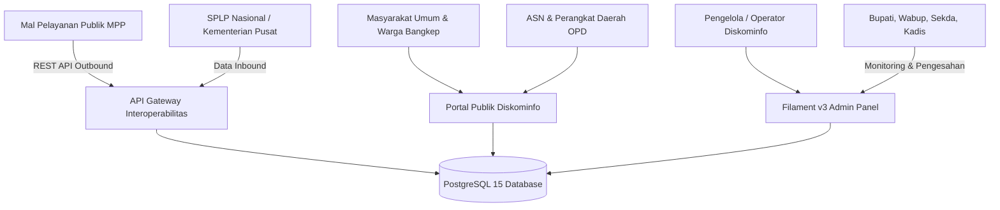

# LAPORAN SIKLUS HIDUP PENGEMBANGAN SISTEM (SYSTEM DEVELOPMENT LIFE CYCLE - SDLC)
## PORTAL RESMI DAN ARSITEKTUR INTEROPERABILITAS SPBE DINAS KOMUNIKASI DAN INFORMATIKA KABUPATEN BANGGAI KEPULAUAN

---

**DISUSUN OLEH:**  
TIM PENGEMBANG TEKNOLOGI INFORMASI DAN KOMUNIKASI  
BIDANG PENGELOLAAN INFORMASI DAN KOMUNIKASI PUBLIK (IKP) / APLIKASI INFORMATIKA (APTIKA)  
DINAS KOMUNIKASI DAN INFORMATIKA KABUPATEN BANGGAI KEPULAUAN  
PROVINSI SULAWESI TENGAH  
TAHUN ANGGARAN 2026  

---

## LEMBAR PENGESAHAN LAPORAN EKSEKUTIF

| Dokumen | Laporan Siklus Hidup Pengembangan Sistem (SDLC) |
|---|---|
| **Nama Aplikasi** | Portal Resmi & Gateway Interoperabilitas SPBE Diskominfo Kab. Banggai Kepulauan |
| **Alamat URL** | `https://diskominfo.banggaikep.go.id` |
| **Versi Rilis** | Versi 2.4.0 (Enterprise Modern Build) |
| **Penanggung Jawab Teknis** | Tim Pengembang Perangkat Lunak & Keamanan Informasi Diskominfo |
| **Instansi Pengguna** | Pemerintah Kabupaten Banggai Kepulauan |
| **Tanggal Pengesahan** | Oktober 2026 |

---

## RINGKASAN EKSEKUTIF (EXECUTIVE SUMMARY)

Pemerintah Kabupaten Banggai Kepulauan melalui Dinas Komunikasi dan Informatika telah menyelesaikan siklus rekayasa perangkat lunak secara menyeluruh untuk pembangunan dan modernisasi **Portal Resmi Diskominfo Banggai Kepulauan (`diskominfo.banggaikep.go.id`)**. 

Pengembangan sistem ini tidak semata-mata menghadirkan situs web informasi dinas konvensional, melainkan membangun **Hub Interoperabilitas Layanan Digital Terpadu** yang mematuhi standar nasional:
1. **Peraturan Presiden No. 95 Tahun 2018 tentang Sistem Pemerintahan Berbasis Elektronik (SPBE)**;
2. **Peraturan Presiden No. 39 Tahun 2019 tentang Satu Data Indonesia (SDI)**;
3. **Pedoman Keamanan Informasi Siber Badan Siber dan Sandi Negara (BSSN)** untuk Tim Tanggap Insiden Siber (CSIRT) Pemerintah Daerah;
4. **Undang-Undang No. 14 Tahun 2008 tentang Keterbukaan Informasi Publik (KIP)**.

Sistem dibangun menggunakan kerangka kerja generasi terbarukan: **Laravel 12 Enterprise (PHP 8.2)**, basis data relasional spasial **PostgreSQL 15**, antarmuka modern reaktif **React 18 + Inertia.js**, panel kendali terpadu **Filament v3** dengan Two-Factor Authentication (2FA), serta infrastruktur mandiri berbasis kontainer **Docker Compose**.

Melalui metodologi *Agile SDLC Iterative Lifecycle*, portal ini berhasil menghadirkan 6 (enam) modul strategis:
- **Penyedia API Terintegrasi (*Outbound Provider API*) untuk Mal Pelayanan Publik (MPP)** (Agenda Pimpinan Daerah dan Katalog Layanan Digital);
- **Klien Konsumen Sistem Penghubung Layanan Pemerintah (*Inbound Consumer SPLP*)** untuk koneksi resmi data kementerian/pusat;
- **Peta GIS Infrastruktur Telekomunikasi, Jaringan Serat Optik, dan Area Blankspot** berbasis koordinat spasial dan dokumentasi foto fisik lapangan;
- **Publikasi Berita & Pengumuman Presisi Tinggi** dengan dukungan pamflet adaptif anti-terpotong (*Auto-Fit Frame*), *Lightbox Fullscreen*, dan format editor teks kaya (*TinyMCE*);
- **Portal Keterbukaan Informasi Publik (PPID)** dan pelacakan status tiket layanan publik mandiri secara real-time;
- **Alat Uji Audit Keamanan Siber Mandiri (*Automated Security Scanner*)** melalui perintah `php artisan app:security-audit` yang mengevaluasi kepatuhan proteksi data dan pertahanan terhadap OWASP Top 10.

Laporan ini disusun secara komprehensif sebagai dokumen pertanggungjawaban teknis dan bahan pelaporan berkala kepada Pimpinan Daerah.

---

## BAB I: PENDAHULUAN & LANDASAN KEBIJAKAN

### 1.1 Latar Belakang
Penyelenggaraan tata kelola pemerintahan yang bersih, efektif, transparan, dan akuntabel di era revolusi industri 4.0 menuntut akselerasi transformasi digital. Dinas Komunikasi dan Informatika memegang peranan krusial sebagai *leading sector* dan koordinator penyelenggaraan SPBE di Kabupaten Banggai Kepulauan.

Sebelum modernisasi ini dilaksanakan, portal informasi daerah menghadapi sejumlah tantangan, antara lain: arsitektur sistem lama yang belum terintegrasi antar OPD (*siloed system*), ketiadaan antarmuka pemrograman aplikasi (API) untuk mendukung Mal Pelayanan Publik (MPP), kesulitan pemetaan aset telekomunikasi dan titik blankspot secara visual geografis, serta perlunya peningkatan ketahanan terhadap ancaman siber yang kian marak menyasar domain pemerintah daerah (`.go.id`).

Oleh karena itu, dilakukan rekayasa ulang sistem (*system re-engineering*) dari tahap perencanaan hingga pemeliharaan terukur menggunakan pendekatan SDLC yang berstandar industri dan taat regulasi nasional.

### 1.2 Landasan Hukum
Pembangunan sistem informasi ini berpijak pada ketentuan peraturan perundang-undangan:
1. Undang-Undang Republik Indonesia Nomor 14 Tahun 2008 tentang Keterbukaan Informasi Publik;
2. Undang-Undang Republik Indonesia Nomor 23 Tahun 2014 tentang Pemerintahan Daerah;
3. Peraturan Presiden Republik Indonesia Nomor 95 Tahun 2018 tentang Sistem Pemerintahan Berbasis Elektronik;
4. Peraturan Presiden Republik Indonesia Nomor 39 Tahun 2019 tentang Satu Data Indonesia;
5. Peraturan Badan Siber dan Sandi Negara Nomor 4 Tahun 2021 tentang Pedoman Penerapan Manajemen Keamanan Informasi SPBE;
6. Peraturan Bupati Banggai Kepulauan tentang Tata Kelola Sistem Pemerintahan Berbasis Elektronik Daerah.

### 1.3 Maksud dan Tujuan
- **Maksud**: Menyediakan platform sistem informasi dinas yang terintegrasi, andal, aman, dan mudah diakses oleh seluruh lapisan masyarakat serta aparatur sipil negara.
- **Tujuan**:
  1. Mewujudkan pusat informasi satu pintu (*single window of information*) kegiatan pembangunan dan siaran pers Pemkab Banggai Kepulauan;
  2. Menyediakan jembatan interoperabilitas data (REST API Gateway) untuk mendukung pelayanan prima di Mal Pelayanan Publik (MPP);
  3. Menyediakan modul konektivitas Sistem Penghubung Layanan Pemerintah (SPLP) resmi nasional;
  4. Mendokumentasikan dan memetakan sebaran infrastruktur digital serta wilayah blankspot secara spasial (GIS);
  5. Menjamin keamanan data publik dan aset sistem informasi sesuai standar kepatuhan BSSN.

---

## BAB II: TAHAP PERENCANAAN & ANALISIS KEBUTUHAN (PLANNING & REQUIREMENTS)

### 2.1 Analisis Kesenjangan Sistem Eksisting (Legacy Gap Analysis)

| Aspek | Kondisi Sistem Lama | Kondisi Setelah Modernisasi (Sistem Baru) |
|---|---|---|
| **Arsitektur Perangkat Lunak** | Monolitik konvensional, lambat saat diakses mobile. | Arsitektur SPA modern via Laravel 12 + Inertia.js + React 18, ultra-cepat. |
| **Keterhubungan Data (Interoperabilitas)** | Tertutup, tidak ada API untuk sistem eksternal / MPP. | Menyediakan REST API Gateway berotentikasi API Key terenkripsi dan klien SPLP. |
| **Data Infrastruktur Jaringan & Menara** | Pencatatan berkas Excel terpisah, tanpa visualisasi peta. | Web GIS interaktif dengan titik koordinat, filter kecamatan, dan foto dokumentasi. |
| **Publikasi Berita & Pamflet** | Format teks kaku, pamflet sayembara/lomba terpotong di layar. | Format TinyMCE presisi tinggi, wadah foto auto-fit adaptif, dan Lightbox zoom. |
| **Keamanan Sistem (Cyber Security)** | Rentan brute force, tanpa 2FA admin, tanpa scanner mandiri. | Filament 2FA, rate limiting ketat, proteksi upload Nginx, dan CLI Security Scanner. |

### 2.2 Identifikasi Pemangku Kepentingan (Stakeholders Matrix)



### 2.3 Analisis Kebutuhan Fungsional (Functional Requirements)
1. **Kelompok Layanan Warga (Front-Office)**:
   - Akses berita, siaran pers, galeri foto/video kegiatan dinas.
   - Akses informasi pengumuman resmi dan pamflet sayembara beresolusi penuh.
   - Pengecekan agenda resmi harian pimpinan daerah (Bupati, Wabup, Sekda).
   - Pengajuan permohonan informasi publik PPID dan pengaduan masyarakat.
   - Pelacakan mandiri status tiket permohonan secara real-time via input nomor tiket/NIP.
   - Pengisian survei kepuasan masyarakat (IKM) secara berkala.
2. **Kelompok Pengelola Sistem (Back-Office / Admin)**:
   - Manajemen konten publikasi dinamis (Berita, Kategori, Banner, Slider, Profil Dinas).
   - Verifikasi dan validasi agenda pimpinan (status: *Draft, Disetujui, Ditolak*).
   - Manajemen titik infrastruktur GIS (penambahan titik BTS, jaringan FO, foto survei fisik, impor/ekspor data Excel).
   - Manajemen API Client (pembuatan token API, pengaturan scope izin, status aktif, whitelist IP).
   - Pengaturan kredensial SPLP pusat (Client ID, Secret Key, Token Endpoint, Healthcheck).
   - Monitoring riwayat log transaksi (*audit trail*) pemanggilan API masuk dan keluar.
3. **Kelompok Integrasi Antar-Lembaga (G2G Interoperability)**:
   - Endpoint `GET /api/v1/interop/agenda` untuk sinkronisasi jadwal pimpinan ke display MPP.
   - Endpoint `GET /api/v1/interop/services` untuk integrasi katalog perizinan & permohonan layanan publik.
   - Service client `SplpClientService` untuk menarik data referensi terverifikasi dari instansi vertikal pusat.

### 2.4 Analisis Kebutuhan Non-Fungsional (Non-Functional Requirements)
- **Keandalan & Ketersediaan**: Target *uptime* 99.9% dengan arsitektur container Docker yang terisolasi dan mudah dipulihkan (*auto-restart policy*).
- **Keamanan Data**: Kredensial sensitif disimpan dalam bentuk enkripsi kriptografi kuat (AES-256-CBC via `Crypt::encryptString` dan one-way bcrypt hashing pada kunci API).
- **Kecepatan Akses**: Waktu muat halaman pertama (*First Contentful Paint*) di bawah 1.5 detik dengan optimasi bundle Vite, lazy-loading gambar, dan kompresi server Gzip/Brotli.
- **Responsivitas**: Adaptif optimal pada seluruh rentang resolusi layar (ponsel cerdas 360px, tablet, hingga layar monitor desktop 4K).

---

## BAB III: TAHAP PERANCANGAN ARSITEKTUR & DESAIN (SYSTEM DESIGN)

### 3.1 Pilihan Arsitektur Teknologi Terpadu (Enterprise Tech Stack)

```
+-----------------------------------------------------------------------------------+
|                        ARSITEKTUR PERANGKAT LUNAK SPBE                            |
+-----------------------------------------------------------------------------------+
|                                                                                   |
|  [PRESENTATION LAYER]   React 18 + Inertia.js + Tailwind CSS + Lucide Icons       |
|                                    ^                                              |
|                                    | (Inertia Protocol / JSON Hydration)          |
|                                    v                                              |
|  [APPLICATION LAYER]    Laravel 12 Framework (PHP 8.2-FPM)                        |
|                         - SecurityHeadersMiddleware & VerifyApiKey                |
|                         - SplpClientService (HTTP Client Connector)               |
|                         - Filament v3 Admin Suite (2FA & RBAC)                    |
|                         - Artisan Security Audit Scanner Engine                   |
|                                    ^                                              |
|                                    | (PDO / Eloquent ORM)                         |
|                                    v                                              |
|  [PERSISTENCE LAYER]    PostgreSQL 15 (Relational & Spatial Geometry)             |
|                                    ^                                              |
|                                    | (Container Orchestration)                    |
|                                    v                                              |
|  [INFRASTRUCTURE LAYER] Docker Compose + Nginx Alpine + Supervisor + Let's Encrypt|
|                                                                                   |
+-----------------------------------------------------------------------------------+
```

1. **Backend Engine - Laravel 12**: Menyediakan pondasi kode yang tangguh, sistem perutean terisolasi (`routes/web.php` dan `routes/api.php`), manajemen migrasi basis data berversi, dan proteksi bawaan terhadap serangan web umum.
2. **Database Engine - PostgreSQL 15**: Dipilih karena keunggulannya dalam menangani data relasional yang masif, integritas transaksional ACID, serta dukungan data koordinat geografis untuk modul GIS.
3. **Frontend Engine - React 18 & Inertia.js**: Menggabungkan kenyamanan produktivitas monolitik Laravel dengan kecepatan luar biasa aplikasi *Single Page Application* (SPA) tanpa perlu membangun API terpisah untuk kebutuhan portal internal.
4. **Administration Panel - Filament v3**: Menyediakan antarmuka manajemen berbasis komponen modern, dilengkapi tabel interaktif, validasi formulir berlapis, dan manajemen hak akses dinamis.
5. **Kontainerisasi - Docker**: Membungkus seluruh aplikasi, Nginx, PHP-FPM, dan database dalam container terisolasi untuk menjamin keseragaman lingkungan pengembangan dan server produksi.

### 3.2 Desain Skema Basis Data Relasional (Database Schema Overview)

Basis data dirancang dengan standar kunci primer berbasis **UUID (Universally Unique Identifier)** untuk mencegah tebakan ID urut (*Insecure Direct Object Reference / IDOR*). Tabel-tabel inti meliputi:
- `users`: Data akun administrator, peran hak akses (*SUPERADMIN / OPERATOR*), email terverifikasi, dan secret key 2FA.
- `Post` & `Category`: Manajemen berita, siaran pers, artikel, kategori, tags, metadata SEO, status terbit, dan views counter.
- `leader_agendas`: Penjadwalan agenda pimpinan (tanggal, waktu, lokasi, nama pimpinan, ringkasan, surat undangan, status persetujuan).
- `gis_infrastructures`: Data aset telekomunikasi (nama menara, operator, tipe teknologi 4G/5G/FO, koordinat latitude-longitude, kondisi operasional, dan lampiran foto fisik lapangan).
- `digital_services`: Katalog layanan digital dinas dan OPD (nama layanan, deskripsi, persyaratan berkas, SOP, tautan sistem).
- `api_clients`: Klien pihak ketiga berizin (nama instansi, hashed API key, scope perizinan, batas masa berlaku, IP whitelist).
- `splp_configs`: Konfigurasi gerbang SPLP nasional (URL gateway, client ID terenkripsi, secret key terenkripsi, service code).
- `interop_logs`: Log audit pertukaran data (IP pemanggil, endpoint, metode HTTP, status kode, respon, execution time).
- `ppid_requests`: Permohonan informasi publik warga, lampiran KTP/berkas, dan status tahapan verifikasi.
- `survey_ratings` & `visitor_logs`: Rekapitulasi indeks kepuasan masyarakat dan pencatatan trafik pengunjung harian.

---

## BAB IV: TAHAP IMPLEMENTASI & PENGEMBANGAN MODUL (IMPLEMENTATION)

### 4.1 Modul Publikasi Informasi & Visual Berita Presisi Tinggi
- **Tampilan Foto Adaptif (*Auto-Fit Media Frame*)**: Mengganti rasio kaku 16:9 dengan bingkai media pintar yang beradaptasi dengan orientasi gambar (vertikal/potret, bujur sangkar, maupun lanskap). Menampilkan latar belakang *ambient blur backdrop* sehingga poster sayembara (seperti Sayembara Logo HUT ke-27) tampil 100% utuh tanpa ada teks yang terpotong.
- **Fitur Lightbox Fullscreen**: Pengunjung dapat memperbesar gambar/pamflet dalam resolusi penuh melalui modal satu klik dengan navigasi penutup `Esc`.
- **Presisi Format Teks Editor (TinyMCE Fidelity)**: Penyelarasan CSS agar teks artikel menampilkan perataan paragraf rata kanan-kiri (*justify*), titik *bullet* daftar (`<ul> > <li>`), penomoran urut (`<ol> > <li>`), spasi jeda paragraf `<p>&nbsp;</p>`, dan tabel bergaris rapi.
- **Integrasi Gambar Pengumuman Beranda**: Kartu pengumuman pada beranda menyajikan thumbnail pamflet pengumuman dengan efek zoom interaktif dan fallback ikon megafon modern.

### 4.2 Modul Interoperabilitas SPBE (Mal Pelayanan Publik & SPLP Nasional)
- **Outbound REST API untuk Mal Pelayanan Publik (MPP)**:
  - `GET /api/v1/interop/agenda`: Mengirimkan daftar agenda resmi pimpinan daerah yang telah disetujui untuk ditampilkan pada papan display informasi MPP.
  - `GET /api/v1/interop/services`: Menyediakan katalog resmi layanan digital Diskominfo untuk integrasi loket pelayanan terpadu.
- **Inbound Client Penghubung Layanan SPLP Pusat**:
  - Disediakan modul mesin HTTP client `App\Services\SplpClientService` dengan kemampuan pengiriman token terotentikasi, *timeout handling*, dan verifikasi skema respon instansi vertikal/kementerian.
- **Audit Trail & Keamanan API**:
  - Validasi otentikasi header `X-API-KEY` via middleware `VerifyApiKey`.
  - Kunci API disimpan dalam bentuk *one-way hash* (bcrypt) sehingga aman dari kebocoran data.
  - Pembatasan frekuensi akses (*rate limiting* `throttle:60,1`) dan pencatatan riwayat transaksi di tabel `interop_logs`.

### 4.3 Modul Sistem Informasi Geografis (Web GIS) Infrastruktur
- Pemetaan visual interaktif sebaran menara telekomunikasi (BTS), jaringan serat optik intra-pemerintah, dan area blankspot per kecamatan di Kabupaten Banggai Kepulauan.
- Setiap titik infrastruktur dilengkapi informasi teknis: nama site, pemilik menara, tinggi menara, status listrik PLN/genset/solar panel, serta foto fisik dokumentasi lapangan.
- Fitur ekspor dan impor massal data infrastruktur menggunakan format spreadsheet Microsoft Excel memudahkan pemutakhiran data berkala oleh staf teknis.

### 4.4 Modul Penjadwalan Agenda Pimpinan Daerah
- Fasilitas pencatatan agenda Bupati, Wakil Bupati, dan Sekretaris Daerah dengan alur disposisi persetujuan pimpinan (*Pending -> Approved/Rejected*).
- Lampiran berkas surat dinas (*PDF/DOC*) yang dapat diunduh oleh staf terkait.
- Hanya agenda berstatus *Approved* yang dipublikasikan ke publik dan diintegrasikan ke display MPP.

### 4.5 Modul PPID & Pelacakan Tiket Mandiri
- Formulir pengajuan permohonan informasi publik secara online sesuai standar Komisi Informasi.
- Fitur pelacakan mandiri (*Self-Service Tracking System*): Masyarakat cukup memasukkan nomor tiket (contoh: `SRV-2026-XXXX` atau `PPID-XXXX`) pada halaman depan untuk memantau status berkas secara transparan (*Pengajuan Diterima -> Verifikasi & Proses -> Selesai / Terbit*).

---

## BAB V: TAHAP PENGUJIAN SISTEM & KEAMANAN SIBER (TESTING & SECURITY)

### 5.1 Strategi Pengujian Sistem
Pengujian perangkat lunak dilakukan secara komprehensif melalui metode:
1. **Black-Box Testing**: Pengujian fungsionalitas antarmuka dari sudut pandang pengguna untuk memastikan semua alur form, navigasi, dan tombol berjalan sesuai spesifikasi.
2. **White-Box Testing**: Pemeriksaan alur kode sumber, middleware, penanganan exception, dan validasi data masukan di tingkat controller.
3. **User Acceptance Testing (UAT)**: Uji terima pengguna bersama staf dan administrator Diskominfo untuk memverifikasi kesesuaian modul operasional.

### 5.2 Alat Audit Keamanan Mandiri (Artisan Security Audit Scanner)
Sebagai wujud kepatuhan terhadap standar BSSN, tim pengembang membangun perintah audit internal:
```bash
docker compose exec app php artisan app:security-audit
```
Perintah ini secara otomatis memindai postur keamanan sistem dan memberikan skor kepatuhan:
- Memverifikasi mode produksi (`APP_DEBUG=false` dan `APP_ENV=production`);
- Menguji kekuatan kunci enkripsi aplikasi (`APP_KEY`);
- Memeriksa pemblokiran akses file sensitif (`.env` dan `.git`) pada folder publik;
- Menguji validitas symlink penyimpanan media publik;
- Mengaudit basis data dan enkripsi kunci API mitra (`api_clients`);
- Mengonfirmasi keaktifan `SecurityHeadersMiddleware`;
- Menghasilkan **Indeks Kepatuhan Keamanan SPBE & Tingkat Kesiapan CSIRT BSSN**.

### 5.3 Mitigasi Kerentanan Standar OWASP Top 10

| Risiko Kerentanan OWASP | Mekanisme Pertahanan yang Diimplementasikan | Status |
|---|---|---|
| **A01: Broken Access Control** | Penerapan Dynamic RBAC, verifikasi sesi terenkripsi, proteksi middleware `Filament2FAMiddleware`, dan pemblokiran URL modul sensitif. | **TERLINDUNGI** |
| **A02: Cryptographic Failures** | Penyimpanan password menggunakan Bcrypt (cost 12), penyimpanan API key dengan One-Way Hash, dan penyimpanan secret key SPLP menggunakan AES-256-CBC. | **TERLINDUNGI** |
| **A03: Injection (SQLi)** | 100% kueri database menggunakan PDO Prepared Statements dan Eloquent ORM. Tidak ada parameter URL yang digabungkan langsung ke string query SQL. | **TERLINDUNGI** |
| **A04: Insecure Design** | Pembatasan frekuensi permintaan (*Rate Limiting*) pada form kontak, survei, pencarian, dan API interoperabilitas. | **TERLINDUNGI** |
| **A05: Security Misconfiguration** | Penonaktifan mode debug di server live, penutupan port database dari akses publik, dan implementasi HTTP Security Headers (`X-Frame-Options: SAMEORIGIN`, `nosniff`, `HSTS`). | **TERLINDUNGI** |
| **A06: Vulnerable Components** | Audit dependensi berkala via `composer audit` dan `npm audit` untuk mendeteksi kerentanan CVE pada pustaka pihak ketiga. | **TERLINDUNGI** |
| **A07: Identification & Auth** | Proteksi percobaan login gagal berulang kali (*brute-force lockout*) dan otentikasi ganda 2FA untuk akun Super Admin. | **TERLINDUNGI** |
| **A08: Software & Data Integrity** | Konfigurasi web server Nginx secara eksplisit menolak eksekusi file skrip PHP di folder upload/storage (`^/storage/.*\.php$ deny all`). | **TERLINDUNGI** |
| **A09: Security Logging & Monitoring** | Pencatatan detail transaksi API di tabel `interop_logs` dan pencatatan kegagalan sistem pada file log terisolasi. | **TERLINDUNGI** |
| **A10: Server-Side Request Forgery** | Validasi dan sanitasi URL endpoint tujuan pada konektor SPLP pusat. | **TERLINDUNGI** |

---

## BAB VI: TAHAP PENYEBARAN SISTEM & DEVOPS (DEPLOYMENT & INFRASTRUCTURE)

### 6.1 Topologi Infrastruktur Server Produksi
Portal di-deploy pada server Virtual Private Server (VPS) berkinerja tinggi dengan spesifikasi dan tata kelola terukur:

```
+-----------------------------------------------------------------------------------+
|                         TOPOLOGI DEPLOYMENT PRODUKSI                              |
+-----------------------------------------------------------------------------------+
|                                                                                   |
|  [PENGUNJUNG INTERNET]                                                            |
|          |                                                                        |
|          v (HTTPS / Port 443 - SSL TLS 1.3 Let's Encrypt)                         |
|  [SERVER HOST VPS /var/www/diskominfo-app]                                        |
|          |                                                                        |
|          +---> [DOCKER CONTAINER: Nginx Reverse Proxy]                             |
|          |         | (Static files / Public assets / Security Headers)            |
|          |         | (Reverse proxy FastCGI ke port 9000)                         |
|          |         v                                                              |
|          +---> [DOCKER CONTAINER: PHP 8.2-FPM Application Engine]                  |
|          |         | (Laravel 12 App + Artisan + Filament Admin)                  |
|          |         | (Supervisor Daemon Worker)                                   |
|          |         v                                                              |
|          +---> [DOCKER CONTAINER: PostgreSQL 15 Database Storage]                 |
|          |         (Data persistensi di docker volume terisolasi)                 |
|          |                                                                        |
+-----------------------------------------------------------------------------------+
```

### 6.2 Otomasi Alur Rilis & Deployment (CI/CD Workflow)
1. Tim pengembang melakukan pembaruan kode dan pengujian di komputer lokal (*Local Dev Tree*);
2. Seluruh komit kode terverifikasi dan di-push ke repositori terpusat GitHub (`origin/main`);
3. Di server produksi VPS, eksekusi pembaruan dilakukan secara terstruktur:
   ```bash
   cd /var/www/diskominfo-app
   git pull origin main
   docker compose exec app npm run build
   docker compose exec app php artisan optimize:clear
   docker compose exec app php artisan app:security-audit
   ```
4. Aset frontend dikompilasi secara efisien (*tree-shaking & minification*), dan cache konfigurasi dioptimalkan untuk respons super-cepat.

### 6.3 Protokol Pencadangan Data & Pemulihan Bencana (Disaster Recovery)
- **Pencadangan Basis Data**: Dump berkala basis data PostgreSQL secara terjadwal menggunakan utilitas `pg_dump` ke penyimpanan cadangan terpisah.
- **Pencadangan Berkas Media**: Folder dokumen dan gambar (`/uploads`) disinkronkan secara berkala.
- **Prosedur Pemulihan**: Waktu pemulihan sistem (*Recovery Time Objective / RTO*) diestimasikan kurang dari 30 menit jika terjadi kegagalan server fisik.

---

## BAB VII: KESIMPULAN, MANFAAT STRATEGIS & REKOMENDASI

### 7.1 Kesimpulan
Pelaksanaan Siklus Hidup Pengembangan Sistem (SDLC) Portal Resmi Diskominfo Kabupaten Banggai Kepulauan telah diselesaikan dengan sukses. Sistem telah beroperasi penuh (*live production*) di alamat `https://diskominfo.banggaikep.go.id` dengan standar kualitas kode tinggi, tampilan responsif dan estetis, serta telah teruji keamanannya.

### 7.2 Nilai Manfaat Strategis Bagi Daerah
1. **Peningkatan Nilai Indeks SPBE Kabupaten**: Keberadaan portal terpadu, integrasi API dengan Mal Pelayanan Publik (MPP), dan keterhubungan SPLP Nasional berkontribusi langsung pada peningkatan nilai evaluasi maturitas SPBE Kabupaten Banggai Kepulauan oleh Kementerian PAN-RB.
2. **Efisiensi dan Transparansi Pelayanan Publik**: Memudahkan warga masyarakat memantau jadwal pimpinan daerah, mengajukan informasi PPID, dan melacak status berkas pelayanan tanpa harus hadir secara fisik di kantor dinas.
3. **Sentralisasi Aset Informasi Spasial**: Dinas memiliki peta geospasial resmi terkait sebaran menara BTS, jaringan serat optik, dan titik blankspot yang sangat berharga untuk perencanaan pembangunan infrastruktur telekomunikasi daerah ke depan.
4. **Kesiapan Tanggap Insiden Siber (CSIRT)**: Memperkuat postur keamanan informasi daerah dari potensi peretasan dan defacement melalui penerapan konfigurasi server yang kokoh dan scanner audit mandiri.

### 7.3 Rekomendasi Tindak Lanjut Ke Depan
Untuk menjamin keberlanjutan dan optimalisasi sistem, direkomendasikan langkah strategis sebagai berikut:
1. **Sosialisasi dan Bimbingan Teknis (Bimtek) Operator OPD**: Menyelenggarakan pelatihan bagi pengelola website dan admin layanan di masing-masing perangkat daerah agar pembaruan data dan layanan dapat dilakukan secara teratur.
2. **Operasionalisasi Interoperabilitas Display MPP**: Memasang display TV interaktif di lobi Mal Pelayanan Publik (MPP) yang terhubung langsung secara real-time ke API Agenda Pimpinan dan Layanan Diskominfo.
3. **Penyambungan Layanan SPLP Spesifik**: Menindaklanjuti permohonan hak akses data sektoral ke instansi pembina data pusat (Kementerian Komdigi, BSSN, Bappenas) untuk menarik data agregat kependudukan dan statistik daerah melalui modul SPLP yang telah siap.
4. **Audit Keamanan Siber Berkala**: Melakukan koordinasi berkala dengan Tim CSIRT Provinsi Sulawesi Tengah dan Badan Siber dan Sandi Negara (BSSN) untuk evaluasi kerentanan (*Vulnerability Assessment*) tahunan.

---

## PENUTUP

Demikian Dokumen Laporan Siklus Hidup Pengembangan Sistem (SDLC) ini disusun sebagai bahan pertanggungjawaban teknis dan bahan pengambilan kebijakan strategis bagi Pimpinan Daerah. Diharapkan inovasi ini dapat memberikan kontribusi nyata bagi kemajuan pembangunan dan pelayanan publik di Kabupaten Banggai Kepulauan.

---

**Salakan, Banggai Kepulauan, Oktober 2026**

**Mengetahui / Mengesahkan:**  
**Kepala Dinas Komunikasi dan Informatika**  
**Kabupaten Banggai Kepulauan**  

\
\
\
**________________________________________**  
**NIP. .................................................**  

**Tim Teknis Pengembang:**  
1. *Lead Software Architect & Full-Stack Engineer* : ...................................  
2. *System Administrator & Security Analyst*       : ...................................  
3. *Database Administrator & GIS Specialist*       : ...................................  
